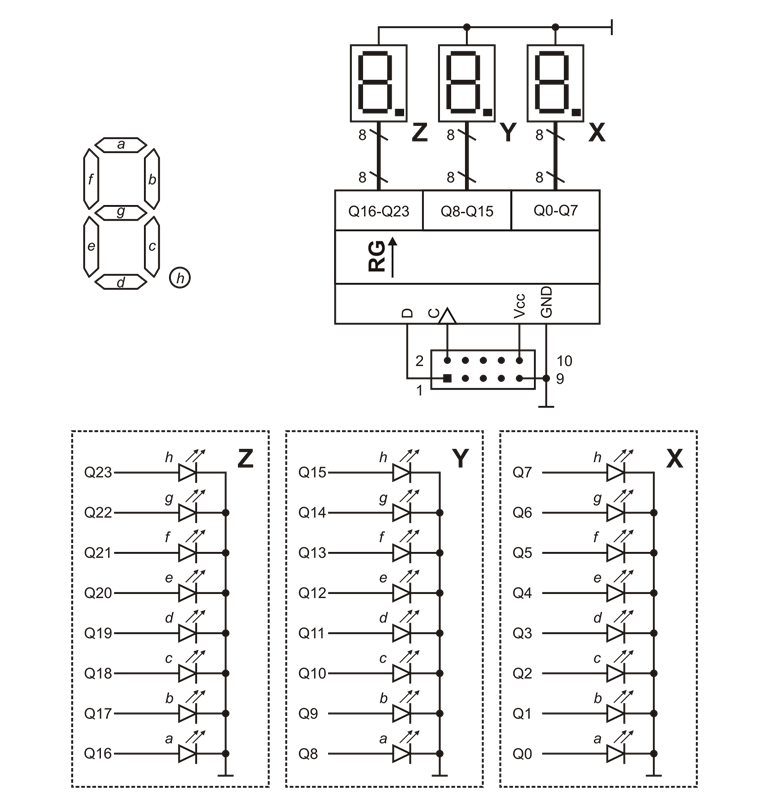

## Digital voltmeter on ATmega16

Here's the task. Create program polling ADC at 10 Hz and outputs the measured voltage in volts to the 7-segment indicator block. 
- Segment X and Y shows milivolts  
- Segment Z shows voltes
> Electrical circuit connection of segments:


>I recommend use [potentiometer/variable resistor](http://www.resistorguide.com/potentiometer/) 

## Code Example

It's important. We are going to use interrupt.
```c
	ISR(ADC_vect){
		unsigned int value;
		TIFR|=(1<<OCF1B); // Output Compare 1 B
		value = ADCH;  // 8bit 0-255
		value = value*0.02; // range 0...5.1 V
		adcSEG(value); // from headfile indicator.h		
	}
```
This is mathematical equation for init range of voltemeter:
```c
	value = value*0.02;
```

## Motivation

It's example of creation simple digital voltemeter using AVR Microcontroller ATmega16. We are going to make a 5V range digital voltmeter using ADC in ATmega16. Don't forget to use datasheet!

## Installation

0. You can use another MCUs. All you need is datasheet. Don't forget change pins!  
1. Make project in AVR Studio choosing 8-bit MCU ATmega16.  
2. Copy code from `adc_voltemeter.c` into your `main.c` file.
3. Add headfile `indicator.h` in project.
4. Build project.

## License

Free
